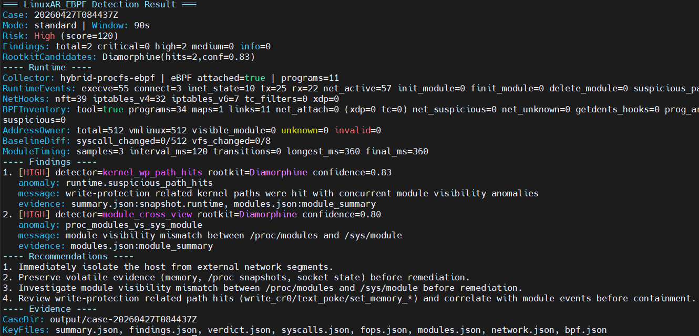
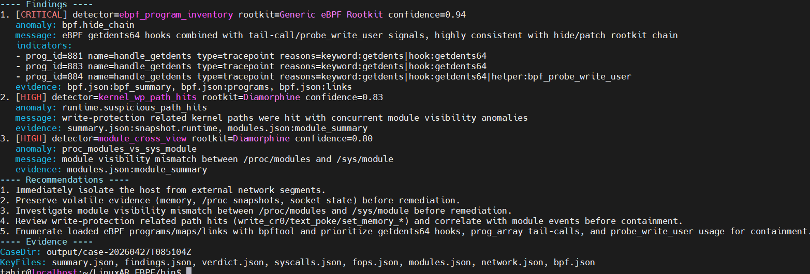

# LinuxAR Sentinel

LinuxAR Sentinel（灵哨）是面向 Linux 主机的 Rootkit 事件响应工具，采用 `run-once` 模式，在一次执行中完成采集、检测、关联分析、证据导出和处置建议输出，降低应急处置门槛。

## 项目目标

- 覆盖 `5.4` 到当前最新稳定内核的检测能力（CO-RE + 运行时能力探测）。
- 检测高危内核态隐藏与劫持行为：
  - `sys_call_table` 指针篡改
  - VFS `fops/iops` 劫持
  - 模块隐藏（含 module/kobject 双重摘链）
  - 网络隐藏（不可见 + 活跃通信）
- 输出结构化证据包，支持应急处置与复盘。

## 当前状态

- 已完成（截至 `2026-04-22`）：
  - M1：运行框架与能力探测骨架完成，可执行 run-once 全流程
  - `rk-agent` 最小可执行 CLI（`cmd/rk-agent`）
  - run-once 阶段编排（bootstrap/collect/analyze/export）
  - 运行时能力探测（内核版本、BTF、ringbuf/perf 提示）
  - 证据目录导出（`summary/timeline/findings/syscalls/fops/modules/network`）
  - 结论层输出（`verdict.json` + 终端风险等级/处置建议）
  - `system collector` 基础采集（`/proc/kallsyms`、`/proc/modules`、`/proc/net/*`、`/proc/filesystems`）
  - hybrid collector：优先尝试 eBPF tracepoint（`execve/init_module/finit_module/delete_module/connect`），失败自动回退 system collector
  - 网络关联增强（`inode -> PID/comm/netns`、`/proc/net` vs `ss` 连接键对账）
  - eBPF 资产盘点（`bpftool prog/map/link`）与可疑模式摘要（`getdents64` hook、`prog_array` tail-call、`probe_write_user`）
  - eBPF 网络后门检测（`bpftool net/tc` 附着图谱 + 可疑程序挂载 `xdp/tc` 路径）
  - eBPF 采集程序占位骨架（`bpf/rk_collector.bpf.c`）
  - `rk-agent` 默认内嵌 `rk_collector.bpf.o`，支持 `RK_EBPF_OBJ` 外部覆盖

## 检测效果

针对diamorphine LKM类型的Rootkit检测结果示例：



针对ebpfRootkit检测结果示例：




## 协作与提交流程

在执行任何 Git 操作前，请先阅读 `docs/Git操作指南_小团队版.md`。

- 分支流：`main`（生产） <- PR <- `develop`（集成） <- PR <- `feature/{dev}-{module}`
- 禁止直接 push 到 `main`，必须通过 PR 合并。
- 提交格式：`{type}({scope}): {描述}`
- `type` 允许：`feat` / `fix` / `docs` / `chore` / `test` / `refactor` / `style`
- WSL 环境 Git 版本要求：`>= 2.32.0`

## 快速开始（开发骨架）

```bash
# 运行一次（输出到 output/case-<id>/）
./rk-agent --output-dir output --window-sec 90

# 需要验证 eBPF attach 时，建议使用 root 运行
sudo ./rk-agent --output-dir output --window-sec 90

# （可选）静默模式（仅输出最终报告）
./rk-agent --output-dir output --window-sec 90 --quiet

# （可选）使用外部 bpf 覆盖内嵌对象
sudo RK_EBPF_OBJ=/abs/path/rk_collector.bpf.o ./rk-agent --output-dir output --window-sec 90
```

## 规划中的主要交付物

- `rk-agent`（一次性任务编排与证据导出）
- eBPF 采集程序（kprobe/fentry/tracepoint）
- 规则引擎（Critical/High/Medium）
- 证据输出：
  - `case-<id>/summary.json`
  - `case-<id>/timeline.ndjson`
  - `case-<id>/verdict.json`
  - `case-<id>/syscalls.json`
  - `case-<id>/fops.json`
  - `case-<id>/modules.json`
  - `case-<id>/network.json`
  - `case-<id>/bpf.json`

## 安全说明

本项目面向安全响应场景。请勿在未授权环境执行内核级检测或处置动作；文档中的命令和流程仅用于合法、受控的测试或应急环境。
